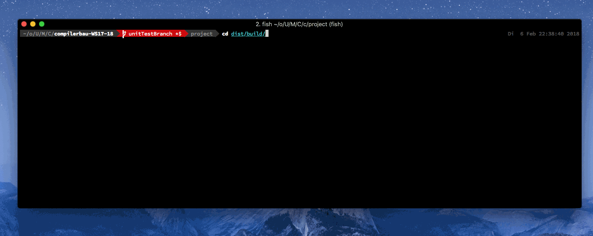
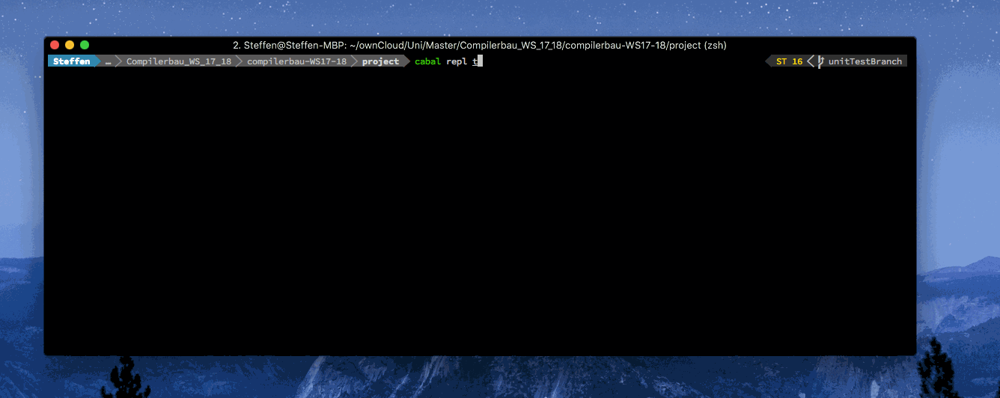

# compilerbau-WS17-18

[](https://travis-ci.com/Pfeifenjoy/compilerbau-WS17-18)


*We're building a compiler. It'll compile things.*

More specifically, this compiler will be able to translate a narrow subset of Java to JVM bytecode, taking a scenic tour through all the necessary steps in the form of multiple passes: lexing, parsing, typechecking, codegen'ing and serializing. 


## Setup

Install using 

```cabal build && cabal install```

Maybe update cabal before using

```cabal update && cabal install```

## Usage
Inside the **dist/build/jc** dir run ```./jc File.java -l logFile```

Run ```./jc -h``` for additional information


## Test Framework

Inside the **project** directory run

```cabal repl test-core```

and call ```main``` in order to see the tests running.



Alternatively run ```cabal test --show-details streaming```

The Test-suite contains multiple testfiles:

```
test/
  - Correct/
    - BitWiseOperation
    - ClassAssign
    - ClassMethods
    - DoWhile
    - EmptyClass
    - EndlessForLoop
    - ForLoop
    - InstanceOf
    - InstanzVariable
    - LocalVariable
    - LogicOperations
    - LogicOperations2
    - MethodArguments
    - MethodCall
    - NewClass
    - OperatorOverloading
    - ShortIf
    - SimpleIf
    - SwitchCase
    - WhileLoop
    - WhileLoopCondition
  - Wrong/
    - Syntax/
      - Arithmetic
      - BraceError
      - ReturnTypeMissing
      - SemicolonMissing
      - TypeMissing
    - Type/
      - InstVarTypeMissmatch
      - MethodCall
      - MultipleReturnType
      - NoReturn
      - ReturnType
      - WrongArgumentType
      - WrongIfComparison
```

and additional example programs. All example programs are validated with normal java programs (print return from compiled example program).

```
test/ExampleProgramma
  - Faculty
  - Fibonacci
  - Fibonacci-Loop
  - FloorSquareRoot
  - GaußSum
  - Multiplication
  - Pow
  - Prime
```
## Resources

* https://hypertextphoenix.atlassian.net/secure/RapidBoard.jspa?rapidView=3&projectKey=COM
* https://compilerbau-ws17-18.slack.com
