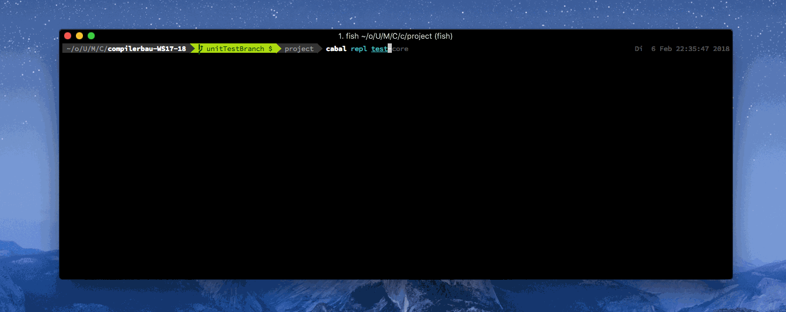

# compilerbau-WS17-18

[](https://travis-ci.com/Pfeifenjoy/compilerbau-WS17-18)

*We're building a compiler. It'll compile things.*

More specifically, this compiler will be able to translate a narrow subset of Java to JVM bytecode, taking a scenic tour through all the necessary steps in the form of multiple passes: lexing, parsing, typechecking, codegen'ing and serializing. TODO more prose?


## Setup

Install using 

```cabal build && cabal install```

Maybe update cabal before using

```cabal update && cabal install```

## Usage

```jc File.java -l logFile```

Run 

```jc -h```

for additional information


## Test Framework

Inside the project dir run

```cabal repl test-core```

and call

```main```

in order to see the tests running.




## Resources

* https://hypertextphoenix.atlassian.net/secure/RapidBoard.jspa?rapidView=3&projectKey=COM
* https://compilerbau-ws17-18.slack.com
